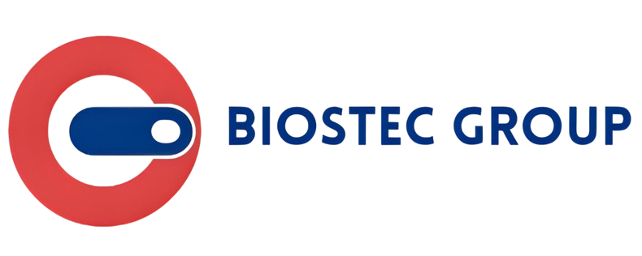

<div align="center">
  

  <h1>Biostec Group — Online Store</h1>
  <p>Johannesburg & Cape Town's trusted source for certified renewed laptops, phones, and devices.</p>

  <p>
    <a href="https://biostecgroup.co.za" target="_blank">biostecgroup.co.za</a> ·
    <a href="https://www.instagram.com/biostecgroup/" target="_blank">Instagram</a> ·
    <a href="https://www.facebook.com/BiostecGroup201/" target="_blank">Facebook</a> ·
    <a href="https://www.tiktok.com/@biostecgroup201" target="_blank">TikTok</a>
  </p>
</div>

---

## About

Full-stack e-commerce platform for Biostec Group — a South African retailer of certified renewed devices. The store features product listings, cart, checkout with Yoco payments, repair bookings, an AI assistant (Karabo), and a full admin panel.

## Tech Stack

| Layer | Technology |
|---|---|
| Frontend | React 19, Vite 6, Tailwind CSS 4, Framer Motion |
| Backend | PHP 8 (built-in server), Express.js proxy |
| Database | MariaDB / MySQL |
| Payments | Yoco Hosted Checkout |
| AI Assistant | Google Gemini (Karabo chat) |
| Email | PHPMailer over SMTP |
| Auth | JWT (PHP), React Context |

## Features

- Certified renewed device listings with grade system (A / B / C)
- Product detail pages with image galleries and specs
- Shopping cart with persistent state (Zustand)
- Secure checkout with Yoco payment integration
- Repair booking system
- Karabo AI assistant (Gemini-powered)
- Email verification and order notifications
- Admin panel — inventory, orders, repairs, users, and banner management
- Dynamic homepage hero carousel (admin-configurable)
- Certified Renewed iPhones section

## Getting Started

**Prerequisites:** Node.js, PHP 8+, MySQL / XAMPP

1. Clone the repo:
   ```bash
   git clone https://github.com/karabonode/biostecgroup_store.git
   cd biostecgroup_store
   ```

2. Install dependencies:
   ```bash
   npm install
   ```

3. Copy the env example and fill in your values:
   ```bash
   cp .env.example .env
   ```

   Key variables to set:
   | Variable | Description |
   |---|---|
   | `DB_HOST`, `DB_USER`, `DB_PASSWORD`, `DB_NAME` | MySQL connection |
   | `JWT_SECRET` | Secret key for auth tokens |
   | `YOCO_PUBLIC_KEY`, `YOCO_SECRET_KEY` | Yoco payment keys |
   | `GEMINI_API_KEY` | Google Gemini API key (Karabo AI) |
   | `SMTP_HOST`, `SMTP_USER`, `SMTP_PASS` | Email (PHPMailer) |

4. Start the dev server (starts PHP API + React/Vite automatically):
   ```bash
   npm run dev
   ```
   App runs at `http://localhost:3000` · PHP API at `http://127.0.0.1:8000`

5. Set up the database:
   ```bash
   # Run the schema against your MySQL instance
   mysql -u root -p biostec_db < database_schema.sql
   ```

## Project Structure

```
├── api/                  # PHP backend
│   ├── auth/             # Login, register, email verification
│   ├── products/         # Product CRUD + image upload
│   ├── orders/           # Order creation, status, payment
│   ├── banners/          # Homepage banner management
│   ├── repairs/          # Repair ticket system
│   ├── admin/            # Admin stats and user management
│   ├── config/           # DB connection, auth helpers, email
│   └── uploads/          # Uploaded product and banner images
├── src/
│   ├── pages/            # React pages (Home, Products, Admin, etc.)
│   ├── components/       # Navbar, Cart, KaraboChat
│   ├── context/          # AuthContext
│   ├── store/            # Zustand cart store
│   └── api/              # Frontend API helpers
├── public/               # Static assets (banners, images, logos)
└── server.ts             # Express server (proxy + Vite in dev)
```

## Payments (Yoco)

The checkout uses Yoco Hosted Checkout with server-side order creation and webhook confirmation.

1. Create order: `POST /api/orders/create.php`
2. Customer pays on Yoco's hosted page
3. Yoco sends webhook to `POST /api/webhooks/yoco.php` — updates `payment_status` to `paid`
4. Success page reads final status from `GET /api/orders/status.php`

Register your webhook URL in the [Yoco dashboard](https://dashboard.yoco.com) pointing to:
```
https://your-domain.com/api/webhooks/yoco.php
```

## Admin Panel

Access at `/admin` — requires an account with `role = admin` in the database.

| Section | Path |
|---|---|
| Dashboard | `/admin` |
| Inventory | `/admin/inventory` |
| Orders | `/admin/orders` |
| Repairs | `/admin/repairs` |
| Users | `/admin/users` |
| Banners | `/admin/banners` |

---

<div align="center">
  <p>© 2026 Biostec Group · Johannesburg & Cape Town, South Africa</p>
  <p>
    <a href="mailto:info@biostecgroup.co.za">info@biostecgroup.co.za</a> ·
    <a href="tel:+27612636912">+27 61 263 6912</a>
  </p>
</div>
